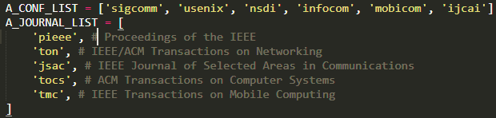
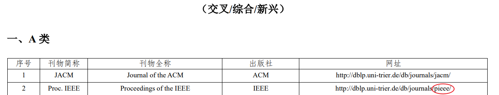
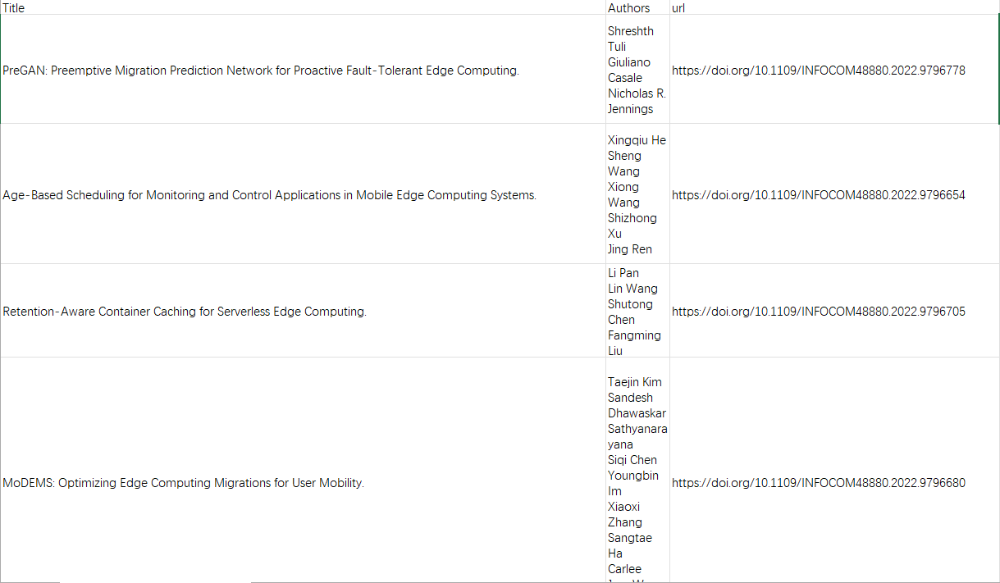

# 计算机论文爬取

从dblp上根据**年份**、**会议/期刊名称**、**关键词**爬取会议及期刊论文

## Requirements

```text
lxml==4.9.2
requests==2.25.1
tqdm==4.62.3
```

## 使用

### 第一步：安装依赖

```shell
pip install -r requirements.txt
```

### 第二步：更改代码中的列表部分



会议和期刊一定要放在**对应的列表**里，缩写要与CCF目录中指定的**网址缩写**对应（一般是一样的）



### 第三步：main.py

```python
python main.py -t 2022 -k edge_computing
```

* "-t" or --time" 期刊/会议年份.
* "-k" or "--keyword" 关键词，空格用下划线_代替.
* "--save_dir" 保存目录.
* 保存的条目有：标题、作者、链接


